# MPC-VDF ZK-Optimistic Protocol Architecture

This document provides a comprehensive overview of the architecture of the Hybrid MPC-VDF Cross-chain VRF (Verifiable Random Function) protocol, from the macro (system-level) down to the micro (component-level).

---

## 1. Macro Architecture: System Overview

The system is designed to provide secure, unbiased, and unpredictable randomness to decentralized applications (dApps) existing on any destination blockchain. It achieves this by decoupling the **randomness generation** (source and off-chain) from the **randomness delivery and verification** (cross-chain transport and destination).

### 1.1 The "Defense-in-Depth" Security Model
The protocol solves the Randomness Paradox using a dual-layer cryptographic approach, reinforced by zero-knowledge proofs for cross-chain compatibility:

1.  **Multi-Party Computation (MPC):** Eliminates *Input Bias*. A set of distinct nodes independently generate random shares and combine them using a threshold cryptography protocol (BLS12-381). No minority coalition can manipulate the output seed.
2.  **Verifiable Delay Function (VDF):** Eliminates *Premature Prediction (Front-running)*. The MPC aggregate seed is passed through an inherently sequential, non-parallelizable mathematical function (Squaring in an Imaginary Quadratic Class Group). This enforces a strict time delay before the final random number is known, ensuring the MPC committee cannot exploit early knowledge of their own generated seed.
3.  **Zero-Knowledge Proofs (ZK-SNARK):** Resolves *Cryptographic Curve Incompatibilities*. EVM chains (like Ethereum/Polygon) natively support BN254 pairing precompiles but lack cheap BLS12-381 support. The off-chain nodes generate a Groth16 ZK-SNARK over BN254 to prove the validity of the BLS12-381 signature, enabling cheap on-chain verification without deploying complex pairing libraries.

### 1.2 The Cross-Chain "Optimistic" Verification
Verifying VDFs and ZK proofs on-chain costs gas. To make the protocol economically viable for dApps, we implement an **Optimistic Verification** model:
-   **Submit:** A relayer submits the randomness payload (VDF output, ZK public signals binding the signature) to the destination.
-   **Challenge Window:** The payload enters a queue for a configurable period (e.g., 10 minutes).
-   **Challenge:** If an independent watcher detects an invalid ZK proof or VDF evaluation, they can trigger an on-chain verification (`0x05` modexp for VDF, Groth16 verifier for ZK). If the challenge succeeds, the submitter is slashed, and the payload is rejected.
-   **Finalize:** If the window passes without a successful challenge, the randomness is considered valid and finalized for the dApp to consume.

---

## 2. Meso Architecture: Component Interaction Flow

The lifecycle of a single randomness request spans four distinct domains: Source Chain, Off-chain Committee, Interoperability Layer, and Destination Chain.

```mermaid
sequenceDiagram
    participant D as dApp User (Sepolia)
    participant R as RandomRouter (Sepolia)
    participant O as Off-chain MPC/VDF Node
    participant B as Bridge Infrastructure
    participant RC as RandomReceiver (Amoy)
    
    D->>R: 1. requestRandomness(seed_user)
    R-->>O: 2. Emit LogRequest
    
    rect rgb(30, 40, 60)
    Note over O: Off-chain Generation & Proof
    O->>O: 3a. MPC Threshold: sig = BLS(seed), seed_col = H(sig)
    O->>O: 3b. VDF Eval: y = seed_col^(2^T)
    O->>O: 3c. VDF Proof: pi = Wesolowski(y)
    O->>O: 3d. ZK SNARK: proof = Groth16(sig, hash)
    end
    
    O->>R: 4. relayVDFPayload(y, pi, ..., ZK_proof)
    R->>B: 5. dispatchPayload(bridgeId, payload)
    
    rect rgb(40, 30, 60)
    Note over B: Interoperability Layer
    B-->>RC: 6. Cross-chain Delivery
    end
    
    RC->>RC: 7a. Verify ZK Groth16 Proof
    RC->>RC: 7b. Enqueue Optimistic Result
    
    rect rgb(60, 30, 40)
    Note over RC: Dispute Resolution
    alt Challenge Window (10 min)
        RC->>RC: Watcher: Valid? (OK) -> Wait
        RC->>RC: Watcher: Invalid? -> VDF Modexp (0x05)
    else Window Expires
        RC-->>D: 8. Finalized Randomness Ready
    end
    end
```

1.  **Trigger (Source Chain - Ethereum Sepolia):**
    -   A user calls `requestRandomness(user_seed)` on the `RandomRouter.sol` contract.
    -   The contract emits a `LogRequest` event.
2.  **Generation & Delay (Off-chain Nodes - Rust):**
    -   The decentralized `network_module` nodes listen to the source chain and pick up the `LogRequest`.
    -   The `crypto_engine` initiates a DKG/Threshold signing round to produce `seed_collective` and an aggregate BLS `signature`.
    -   The nodes independently compute the VDF over `seed_collective`, yielding the delayed output `y` and a Wesolowski proof `pi`.
    -   The node generates a Groth16 ZK-SNARK proving knowledge of the BLS signature and binding it to the payload data.
3.  **Transport (Interoperability Layer):**
    -   The winning node (or designated relayer) invokes `relayVDFPayload` on the Source `RandomRouter.sol`, passing the `y`, `pi`, `seed_collective`, and ZK public signals.
    -   The Router dispatches the payload via a configured `IBridgeAdapter` (e.g., Axelar, LayerZero, Wormhole).
4.  **Delivery & Challenge (Destination Chain - Polygon Amoy):**
    -   The destination bridge adapter delivers the payload to `RandomReceiver.sol`.
    -   `RandomReceiver` verifies the ZK public signals (ensuring the payload hash matches the signed data).
    -   The result is optimistically queued.
    -   Upon window expiry, the result is available for the consuming dApp.

---

## 3. Micro Architecture: Codebase Structure

The project is structured into modular domains, separating concerns between on-chain smart contracts, off-chain routing, and cryptographic heavy-lifting.

### 3.1 Smart Contracts (`contracts/`)
Written in Solidity, managed by Hardhat.

*   **`RandomRouter.sol` (Source):** The entry point for requests and the gateway for dispatching payloads. It abstracts away bridge-specific logic.
*   **`adapters/` (Source & Destination):** Contracts implementing `IBridgeAdapter.sol`. These wrap specific cross-chain protocols (Axelar, LayerZero) to provide a uniform `.dispatchPayload()` interface for the router.
*   **`RandomReceiver.sol` (Destination):** The optimistic queue manager. Implements state machine logic (`submitOptimisticResult`, `challengeResult`, `finalizeResult`).
*   **`VDFVerifier.sol`:** Contains the fallback logic to verify Wesolowski VDF proofs on-chain utilizing the EVM's `0x05` (modexp) precompile.
*   **`circuits/` (ZK Circom):** Contains the `bls_commitment.circom` circuit definition, TS setup/prove/verify scripts, and generates `Groth16Verifier.sol`.

### 3.2 Off-chain Crypto Engine (`off-chain/crypto_engine/`)
Pure Rust library dedicated to cryptography. Has no knowledge of blockchains or networks.

*   **`mpc/`:** Implements the BLS12-381 threshold signature scheme, aggregating shares from multiple nodes into a single, deterministic `seed_collective`.
*   **`vdf/`:** Implements the Imaginary Quadratic Class Group (IQCG) VDF. Contains the sequential squarer and the Wesolowski proof generator.
*   **Pipeline:** Orchestrates the flow: `User Seed -> MPC Threshold -> VDF Squarer -> VDF Proof -> Output`.

### 3.3 Off-chain Network Module (`off-chain/network_module/`)
Rust async application focused on I/O, routing, and blockchain interactions.

*   **`main.rs`:** The daemon loop. Polls RPCs, feeds data to the crypto engine, and triggers relays.
*   **`bridges.rs`:** Implements the multi-bridge failover logic (`MultiBridgeRouter`). Attempts dispatch via priority (e.g., LayerZero first, Axelar second) with automated retries and timeout management.
*   **`rpc.rs`:** Handles Ethereum event filtering and transaction submission via `ethers-rs`.

---

## 4. Key Design Decisions & Rationale

1.  **Why Circom/Groth16 instead of full SP1 zkVM?**
    *   While a zkVM can generically prove the entire Rust pipeline, generating STARK proofs for complex pairing operations currently requires hundreds of gigabytes of RAM.
    *   Circom + Groth16 allows us to write a highly optimized, custom circuit just for the BLS12-381 signature verification step. The "Tier 1" commitment approach compiles to ~200k constraints, enabling proof generation in seconds on a standard 16GB RAM laptop, making academic benchmarking feasible.
2.  **Why IQCG VDFs instead of RSA?**
    *   RSA requires a trusted setup (generation of a modulus $N$ with unknown factorization). An IQCG VDF dynamically generates a class group from the input seed (using the seed to derive a negative prime discriminant $\Delta$). This creates a perfectly decentralized, setup-free environment.
3.  **Why Bridge Adapters?**
    *   Cross-chain protocols frequently change APIs or deprecate networks. By forcing the `RandomRouter` to speak to a generic `IBridgeAdapter`, we can swap transport layers (e.g., switching from Wormhole to CCIP) without modifying the core security logic or re-auditing the router.
4.  **Why Optimistic Verification?**
    *   Even with efficient precompiles (`0x05`), doing thousands of modular exponentiations on-chain to verify a VDF can cost hundreds of thousands of gas. By making it optimistic, the "happy path" (which occurs 99.9% of the time in a game-theory aligned system) only pays for calldata storage, drastically reducing operational costs for DAOs.
