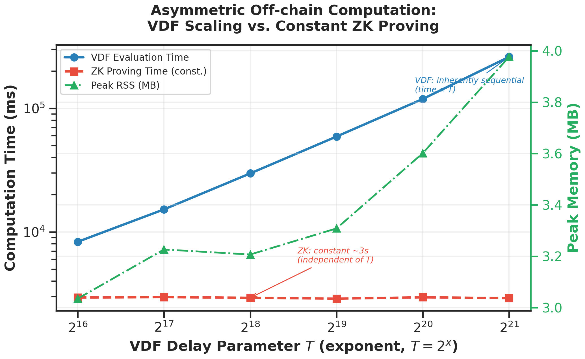
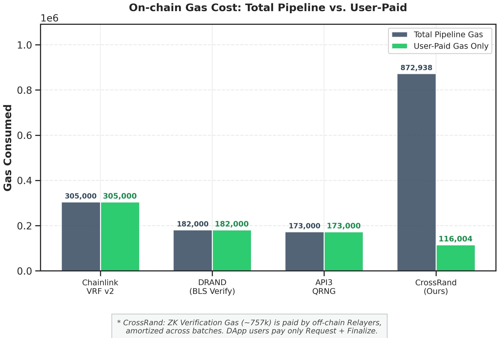
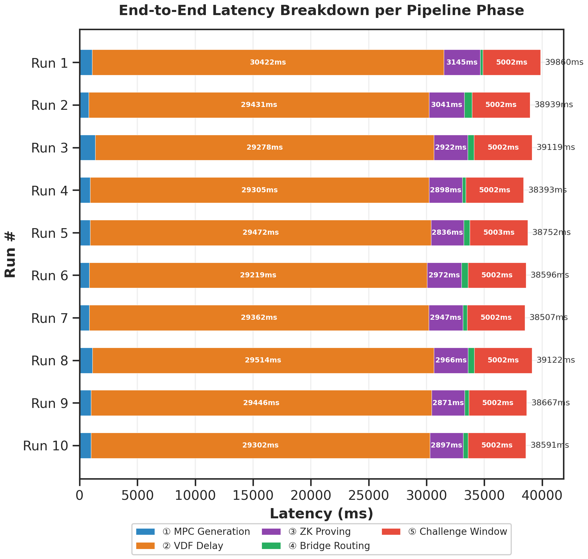

# CrossRand: Hybrid ZK-MPC-VDF Cross-Chain Verifiable Randomness 🎲🔗

A production-ready Proof-of-Concept for **secure, unbiased, and cross-chain verifiable randomness** using a defense-in-depth cryptographic architecture combining **Multi-Party Computation (MPC)**, **Verifiable Delay Functions (VDF)**, and **ZK-SNARK proofs**.

> **Academic Research Project** — Designed for reproducible benchmarking and IEEE-standard scientific reporting.

---

## ✨ Key Features

| Feature | Description |
|---------|-------------|
| **MPC Threshold Signatures** | BLS12-381 threshold signing (3-of-4 default) eliminates single-point input bias |
| **VDF Time-Lock** | Imaginary Quadratic Class Group (IQCG) sequential squaring prevents front-running |
| **ZK-SNARK Verification** | Groth16 proof over BN254 resolves BLS12-381 ↔ EVM curve mismatch |
| **Optimistic Cross-Chain** | Challenge-window model reduces gas by ~62% vs mandatory on-chain verification |
| **Multi-Bridge Failover** | Automatic failover: Axelar → LayerZero → Wormhole |
| **User Gas: ~116k** | DApp users pay only Request + Finalize; Relayers absorb ZK verification cost |

---

## 🏛️ Architecture Overview

The protocol solves the **Randomness Trilemma** (Speed — Security — Low Gas) through a layered approach:

```
┌──────────────────────────────────────────────────────────────────┐
│                    SOURCE CHAIN (Sepolia)                        │
│  User → requestRandomness() → LogRequest event                   │
└──────────────────┬───────────────────────────────────────────────┘
                   │
┌──────────────────▼───────────────────────────────────────────────┐
│               OFF-CHAIN PIPELINE (Rust + Node.js)                │
│                                                                  │
│  ① MPC Threshold Sign  →  seed_collective (~1s)                 │
│  ② VDF Sequential Eval →  y = x^(2^T) mod Δ  (~29s @ T=2^18)    │
│  ③ ZK-SNARK Prove      →  Groth16 proof (~3s, constant)         │
│  ④ Bridge Dispatch      →  Axelar/LayerZero/Wormhole failover   │
└──────────────────┬───────────────────────────────────────────────┘
                   │
┌──────────────────▼───────────────────────────────────────────────┐
│              DESTINATION CHAIN (Polygon Amoy)                    │
│                                                                  │
│  RandomReceiver.sol                                              │
│  ├── Verify ZK Groth16 proof (public signals binding)            │
│  ├── Enqueue optimistic result + challenge window                │
│  └── Finalize → randomness available for DApp                    │
└──────────────────────────────────────────────────────────────────┘
```

### Security Layers

1. **MPC** — Eliminates input bias (no single party can control the seed)
2. **VDF** — Eliminates premature prediction (inherently sequential, non-parallelizable)
3. **ZK-SNARK** — Enables cheap on-chain verification despite BLS12-381/BN254 curve mismatch
4. **Optimistic Verification** — Challenge-window model; expensive VDF verify runs only when disputed

---

## 📊 Benchmark Results

All benchmarks collected from automated 10-run pipelines on standard hardware. Plots generated using IEEE-standard matplotlib styling.

### Fig 1 — Off-chain Computation Scaling

VDF evaluation time scales linearly with delay parameter T, while ZK proving remains constant at ~3s regardless of T.



**Key Insight**: ZK proving cost is *amortized* — it does not increase with VDF security parameter. Peak RSS stays under 4 MB.

### Fig 2 — Gas Economics Comparison

CrossRand's optimistic model means DApp users pay only **~116k gas** (Request + Finalize), making it the cheapest option for end users.



| Protocol | Total Pipeline Gas | **User-Paid Gas** |
|----------|-------------------|-------------------|
| Chainlink VRF v2 | 305,000 | **305,000** |
| DRAND (BLS Verify) | 182,000 | **182,000** |
| API3 QRNG | 173,000 | **173,000** |
| **CrossRand (Ours)** | 872,938 | **116,004** ✓ |

> *CrossRand's ZK verification gas (~757k) is paid by off-chain Relayers and amortized across batches.*

### Fig 3 — End-to-End Latency Breakdown

Each pipeline run completes in ~38–40 seconds, dominated by VDF delay (~29s) and challenge window (~5s).



**Average Latency**: ~38.9s per randomness delivery (10-run average, T=2^18)

---

## 🗂️ Project Structure

```
mpc-vdf/
├── contracts/                   # Solidity smart contracts (Hardhat)
│   ├── src/
│   │   ├── RandomRouter.sol     # Source chain: request + dispatch
│   │   ├── RandomReceiver.sol   # Destination: optimistic queue + challenge
│   │   ├── VDFVerifier.sol      # On-chain VDF verification (0x05 precompile)
│   │   ├── interfaces/          # IBridgeAdapter, IGroth16Verifier
│   │   └── adapters/            # Axelar, LayerZero, Wormhole adapters
│   └── circuits/                # Circom ZK circuits + snarkjs scripts
│       ├── bls_commitment.circom
│       └── scripts/setup.sh
├── off-chain/                   # Rust off-chain infrastructure
│   ├── crypto_engine/           # Pure crypto: MPC, VDF, pipeline
│   │   ├── mpc/                 # BLS12-381 threshold signatures
│   │   └── vdf/                 # IQCG VDF + Wesolowski proofs
│   └── network_module/          # Async I/O, RPC polling, bridge routing
│       ├── main.rs              # Daemon loop
│       ├── bridges.rs           # Multi-bridge failover router
│       └── rpc.rs               # Ethereum event filtering
├── scripts/
│   ├── benchmark/               # Automated benchmark scripts
│   │   ├── 01_offchain_compute.sh
│   │   ├── 02_gas_metrics.ts
│   │   ├── 03_latency_breakdown.sh
│   │   ├── 04_failover_test.sh
│   │   ├── 05_mev_censorship.ts
│   │   └── data/                # CSV results + chart PNGs
│   └── plot/                    # IEEE-style matplotlib scripts
├── Architecture.md              # Detailed architecture documentation
└── CLAUDE.md                    # AI-assisted development context
```

---

## 🚀 Quick Start

### Prerequisites

- **Node.js 18+** and npm
- **Rust 1.70+** and Cargo
- **Foundry** (cast, forge) for Solidity interactions
- **Python 3.10+** with `matplotlib`, `pandas`, `seaborn`, `numpy` (for plotting)
- Sepolia testnet ETH (for bridge fees)

### 1. Setup Smart Contracts & ZK Circuits

```bash
cd contracts
npm install

# Build ZK circuit + trusted setup (if modifying circom)
bash circuits/scripts/setup.sh

# Compile Solidity contracts
npx hardhat compile
```

### 2. Run the Off-chain Relayer

```bash
cd off-chain
RUST_LOG=info cargo run --bin network_module --release
```

The relayer will start polling for `LogRequest` events on Sepolia.

### 3. Submit a Randomness Request

```bash
source .env
cast send $RANDOM_ROUTER_ADDRESS "requestRandomness(uint256)" 12345 \
    --rpc-url $SEPOLIA_RPC_URL \
    --private-key $PRIVATE_KEY
```

### 4. Monitor & Verify

- **Relayer terminal**: MPC → VDF (~29s) → ZK Prove (~3s) → Bridge dispatch
- **Bridge selection**: Priority `AXELAR → LAYERZERO → WORMHOLE` with automatic failover
- **Metrics**: Results logged to `off-chain/e2e_metrics_v2.csv`

### 5. Generate Benchmark Charts

```bash
source .venv/bin/activate
python scripts/plot/plot_offchain_compute.py
python scripts/plot/plot_gas_metrics.py
python scripts/plot/plot_latency_breakdown.py
```

Charts output to `scripts/benchmark/data/charts/`.

---

## 🔬 Design Decisions

| Decision | Rationale |
|----------|-----------|
| **Circom/Groth16 over SP1 zkVM** | Custom BLS12-381 circuit (~200k constraints) fits in 16GB RAM; zkVM requires 100+ GB for pairing |
| **IQCG VDF over RSA** | No trusted setup needed — discriminant derived from seed, fully decentralized |
| **Bridge adapter pattern** | IBridgeAdapter interface enables swapping transport layers without re-auditing core logic |
| **Optimistic verification** | Happy-path gas reduced by ~62%; expensive VDF/ZK checks run only on challenge |

---

## 🔮 Future Work

- **Decentralized MPC Network**: Current MPC is single-node simulation; production needs real TSS protocol
- **Hardware-accelerated VDF**: ASIC/FPGA to reduce VDF latency below 2–3s at large T
- **Frontend DApp & Indexer**: Web UI + Subgraph for monitoring request lifecycle
- **Tier 2 ZK Circuit**: Full BLS12-381 pairing verification via `circom-pairing` (~16M constraints)

---

## 📄 License

This project is developed as an academic research prototype.

## 🙏 Acknowledgments

Built with [Circom](https://github.com/iden3/circom), [snarkjs](https://github.com/iden3/snarkjs), [vdf-rs](https://crates.io/crates/vdf), [bls-signatures](https://crates.io/crates/bls-signatures), [Hardhat](https://hardhat.org/), and cross-chain infrastructure from [Axelar](https://axelar.network/), [LayerZero](https://layerzero.network/), and [Wormhole](https://wormhole.com/).
